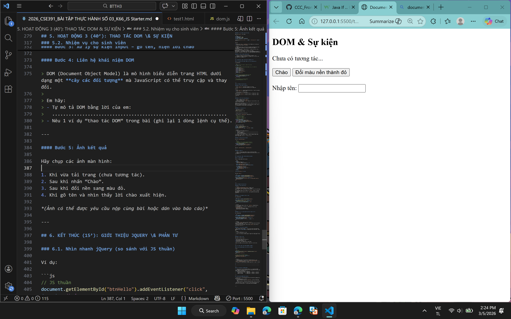
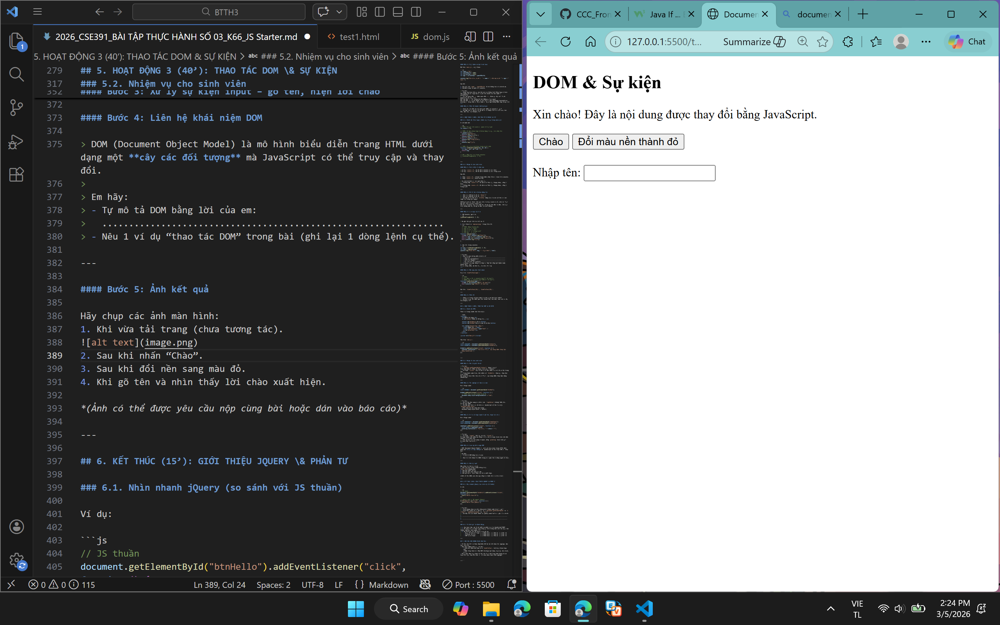
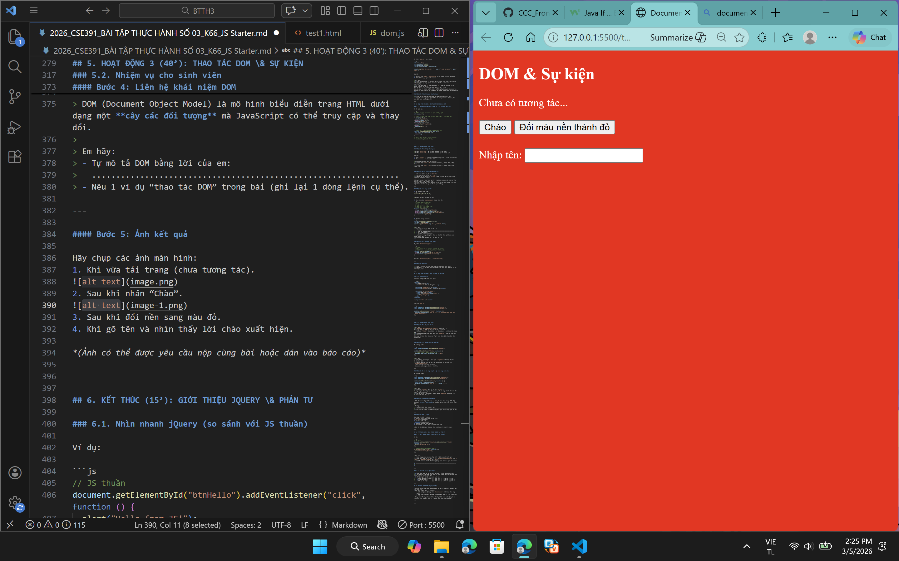

## BTTH03: JS nền tảng, DOM & Sự kiện

**Đối tượng:** Sinh viên chưa học lý thuyết JavaScript

---

## 1. MỤC TIÊU HỌC TẬP

Sau buổi lab, sinh viên có thể:

- Mô tả được JavaScript là gì, chạy ở đâu, khác HTML/CSS ở điểm nào.
- Viết được các đoạn JS đơn giản với:
  - Biến, kiểu dữ liệu cơ bản (number, string, boolean),
  - Cú pháp lệnh, toán tử đơn giản,
  - Cấu trúc điều khiển if/else, vòng lặp đơn giản,
  - Hàm (function) có tham số và giá trị trả về.
- Thao tác được với DOM:
  - Lấy phần tử bằng `document.getElementById`,
  - Thay đổi nội dung văn bản, kiểu dáng (style),
  - Lắng nghe và xử lý một số sự kiện cơ bản: `click`, `input`.
- Nhận biết jQuery là một thư viện hỗ trợ thao tác DOM/sự kiện (ở mức nhận diện, chưa cần sử dụng thành thạo).

---

## 2. CẤU TRÚC THỜI GIAN BUỔI LAB
- 03 tiết thực hành.

---

## 3. HOẠT ĐỘNG 1 (45’): GIỚI THIỆU JS & CÚ PHÁP CƠ BẢN

### 3.1. Chuẩn bị file HTML & JS

Tạo file `lab-js-basic.html`:

```html
<!DOCTYPE html>
<html lang="vi">
<head>
  <meta charset="UTF-8">
  <title>Lab JS Cơ bản</title>
</head>
<body>
  <h1>Khám phá JavaScript</h1>
  <p id="welcome">Chưa có JavaScript...</p>
  <button id="runBtn">Nhấn để chạy JS</button>

  <script src="main.js"></script>
</body>
</html>
```

Tạo file `main.js`:

```js
console.log("Hello from JavaScript!");
```


---

### 3.2. Nhiệm vụ cho sinh viên

#### Bước 1: Mở file \& Quan sát bằng Console

1. Mở `lab-js-basic.html` trong trình duyệt (Chrome/Edge/…).
2. Mở DevTools → tab **Console**.
3. Quan sát thông báo xuất hiện.

> Câu hỏi:
> - Em thấy dòng thông báo nào trong console? Hello from JavaScript!
> - Điều này cho em biết JavaScript đang làm gì khi trang web được tải?
Khi trang web được tải, trình duyệt sẽ đọc file HTML, sau đó nạp và thực thi file main.js. Lệnh console.log("Hello from JavaScript!") trong file này được chạy ngay lập tức, và kết quả hiển thị trên tab Console.
---

#### Bước 2:  “JavaScript là gì?” (Tra cứu nhanh)

Sử dụng 1–2 nguồn tài liệu (vd. W3Schools, freeCodeCamp, …), tóm tắt:

> a) JavaScript chạy ở đâu? (Trình duyệt / Server / Cả hai?) 
JavaScript có thể chạy trong trình duyệt và trên server như Node.js.
> b) HTML, CSS, JavaScript mỗi phần chịu trách nhiệm chính về điều gì?
>
> - HTML: giúp xây dựng khung, cấu trúc của 1 trang web
> - CSS: giúp tách biệt giao diện khỏi nội dung HTML, giúp trang trí giao diện
> - JavaScript: giúp trang web tương tác được (bấm nút, vuốt, chat, bản đồ...).

---

#### Bước 3: Thử nghiệm biến \& kiểu dữ liệu trong Console

Trong tab Console, gõ từng dòng sau và ghi lại kết quả:

```js
let age = 20;
const name = "An";
let isStudent = true;

typeof age;
typeof name;
typeof isStudent;

1 + 2 * 3;
"Hello " + "world";
```

> Câu hỏi:
> - Kết quả `typeof age` là gì? number
> - Kết quả `typeof name` là gì?  string
> - Kết quả `typeof isStudent` là gì? boolean
> - Em hãy tự mô tả ngắn gọn:
>   - `number` là: kiểu dữ liệu số nguyên, số thực
>   - `string` là: kiểu dữ liệu ký tự, văn bản, được đặt trong dấu " " hoặc ' '
>   - `boolean` là: kiểu dữ liệu logic, chỉ có true hoặc false

---

#### Bước 4: Viết đoạn script tính tuổi

Mở file `main.js`, viết thêm:

```js
let name = "An";
let yearOfBirth = 2005;
let currentYear = 2026;
let age = currentYear - yearOfBirth;

console.log("Xin chào, mình là " + name + ", năm nay mình " + age + " tuổi.");
```

Sau đó:

1. Đổi giá trị `name`, `yearOfBirth` thành thông tin của chính em.
2. Reload trang \& quan sát console.

> Câu hỏi:
> - Dòng log hiển thị gì sau khi em sửa thông tin? Dòng log sẽ hiển thị thông tin dữ liệu mới mà mình vừa chỉnh sửa tại name và yearOfBirth
> - Nếu em quên dấu `;` hoặc quên dấu `+`, điều gì xảy ra? Trình duyệt báo lỗi thế nào?
Khi xóa dấu ';' thì chương trình vẫn chạy bình thường vì JavaScript có cơ chế tự thêm dấu chấm phẩy
Khi xóa dấu '+' trình duyệt sẽ báo lỗi cú pháp Uncaught SyntaxError: missing ) after argument list

---

#### Bước 5: Phản tư nhanh (Reflection)

> - Điều thú vị nhất em vừa khám phá được về console là gì?
> - Em gặp lỗi cú pháp nào? Em đã xử lý bằng cách nào (tự sửa, hỏi bạn, đọc lỗi, tìm Google, …)?
- Điều thú vị nhất về console: Em thấy console giống như “cửa sổ giao tiếp” giữa mình và JavaScript. Mỗi khi chạy lệnh console.log, em có thể quan sát ngay kết quả hoặc thông báo, rất tiện để kiểm tra và debug.
- Lỗi cú pháp gặp phải: Em từng quên dấu + khi nối chuỗi, và trình duyệt báo lỗi SyntaxError: Unexpected string.
- Cách xử lý: Em đọc thông báo lỗi trong Console để tìm vị trí sai, sau đó tự sửa lại cú pháp. Nếu chưa rõ, em có thể tìm Google để hiểu thêm.

---

## 4. HOẠT ĐỘNG 2 (40’): CẤU TRÚC ĐIỀU KHIỂN \& HÀM

### 4.1. Chuẩn bị file logic (hoặc viết tiếp trong main.js)

Ví dụ đoạn mã:

```js
// TODO: Đổi giá trị score và quan sát kết quả
let score = 7.5;

// TODO: Dự đoán điều kiện if/else đang làm gì, rồi chạy thử
if (score >= 8) {
  console.log("Giỏi");
} else if (score >= 6.5) {
  console.log("Khá");
} else if (score >= 5) {
  console.log("Trung bình");
} else {
  console.log("Yếu");
}

// TODO: Viết hàm tính điểm trung bình 3 môn
function tinhDiemTrungBinh(m1, m2, m3) {
  let avg = (m1 + m2 + m3) / 3;
  return avg;
}

// Gợi ý dùng thử hàm trong console:
// tinhDiemTrungBinh(8, 7, 9);
```


---

### 4.2. Nhiệm vụ cho sinh viên

#### Bước 1: Đoán trước – chạy sau

> a) Nếu `score = 9`, em dự đoán console sẽ in: Giỏi
> b) Nếu `score = 6`, em dự đoán console sẽ in: Trung bình

Sau đó:

1. Thay `score = 9`, reload trang hoặc chạy file và kiểm tra console.
2. Thay `score = 6`, kiểm tra lại.

> So sánh dự đoán và kết quả thực tế:
> - Trường hợp `score = 9`: Dự đoán vs Thực tế: Giống nhau, cùng là Giỏi
> - Trường hợp `score = 6`: Dự đoán vs Thực tế: Giống nhau, cùng là Trung bình

---

#### Bước 2: Mô tả lại if/else bằng lời

> - Khi nào chương trình in `"Giỏi"`?
> - Khi nào chương trình in `"Yếu"`?
> - Em hãy mô tả cấu trúc `if/else` bằng lời của em (có thể ví von “ngã rẽ” trong đời sống):

Chương trình in 'Giỏi' khi giá trị của biến score >= 8, còn in 'Yếu' khi giá trị của biến score < 5
Cấu trúc if/else: Nếu trời mưa thì chúng ta cần mặc áo mưa. Còn nếu trời không mưa thì chúng ta mặc áo bình thường

---

#### Bước 3: Làm việc với hàm

1. Mở Console, gọi hàm:
```js
tinhDiemTrungBinh(8, 7, 9);
```

> Em ghi lại giá trị hàm trả về: 8

2. Viết thêm hàm `xepLoai(avg)` trong file JS:
```js
  // TODO: Dùng if/else để:
  // avg >= 8  -> "Giỏi"
  // avg >= 6.5 -> "Khá"
  // avg >= 5  -> "Trung bình"
  // còn lại   -> "Yếu"
function xepLoai(avg) {
  if (avg >= 8) return "Giỏi";
  else if (avg >= 6.5) return "Khá";
  else if (avg >= 5) return "Trung bình";
  else return "Yếu";
}
```

3. Gọi thử trong console:
```js
let avg = tinhDiemTrungBinh(8, 7, 9);
let loai = xepLoai(avg);
console.log("Điểm TB:", avg, " - Xếp loại:", loai);
```

> Câu hỏi:
> - Một hàm gồm những phần chính nào?
>   - Tên hàm: dùng để gọi và phân biệt hàm
>   - Tham số (parameters): dữ liệu đầu vào mà hàm nhận để xử lý
>   - Thân hàm (body): tập hợp các câu lệnh bên trong {} để thực hiện công việc
>   - Giá trị trả về (return): kết quả hàm trả về cho nơi gọi
> - Ưu điểm của việc dùng hàm thay vì lặp lại cùng một đoạn code nhiều lần là gì?
Tái sử dụng code, dễ bảo trì, tổ chức rõ ràng và dễ đọc hơn
---

#### Bước 4: Mở rộng nhỏ (tuỳ chọn)

Viết hàm `kiemTraTuoi(age)`:

```js
  // TODO:
  // Nếu age >= 18 -> console.log("Đủ 18 tuổi");
  // Ngược lại -> console.log("Chưa đủ 18 tuổi");
function kiemTraTuoi(age) {
  if(age >= 18){console.log("Đủ 18 tuổi");}
  else {console.log("Chưa đủ 18 tuổi");}
}
```

Gọi thử: `kiemTraTuoi(16);`, `kiemTraTuoi(20);`.

---

#### Bước 5: Phản tư

> - Phần nào trong if/else hoặc hàm khiến em khó hiểu nhất?
- Em thấy khó nhất là việc phân biệt rõ ràng các nhánh trong cấu trúc if/else, đặc biệt khi có nhiều điều kiện liên tiếp (else if)
> - Em đã làm gì để vượt qua (thử nhiều lần, hỏi bạn, xem lại ví dụ, tra Google, …)?
- Em đã thử chạy nhiều lần với các giá trị khác nhau để quan sát kết quả thực tế. Ngoài ra, em đọc lại ví dụ trong tài liệu và tra Google để hiểu thêm cách hoạt động của if/else

---

## 5. HOẠT ĐỘNG 3 (40’): THAO TÁC DOM \& SỰ KIỆN

### 5.1. Chuẩn bị HTML

Thêm vào trang (hoặc tạo file mới):

```html
<section>
  <h2>DOM & Sự kiện</h2>
  <p id="status">Chưa có tương tác...</p>

  <button id="btnHello">Chào</button>
  <button id="btnRed">Đổi màu nền thành đỏ</button>

  <div style="margin-top: 20px;">
    <label>Nhập tên: </label>
    <input id="nameInput" type="text" />
    <p id="greeting"></p>
  </div>
</section>

<script src="dom.js"></script>
```

Tạo file `dom.js`:

```js
const statusEl = document.getElementById("status");
const btnHello = document.getElementById("btnHello");

btnHello.addEventListener("click", function () {
  statusEl.textContent = "Xin chào! Đây là nội dung được thay đổi bằng JavaScript.";
});
```


---

### 5.2. Nhiệm vụ cho sinh viên

#### Bước 1: Đọc \& giải thích

> Câu hỏi:
> - `document.getElementById("status")` đang làm gì?
Truy cập phần tử HTML có thuộc tính id = "status"
> - Sự kiện `"click"` xảy ra khi nào? Khi nhấn vào nút Chào tại trang web
> - Trong đoạn code trên, khi nhấn nút `btnHello`, điều gì thay đổi trên trang?
Nội dung sẽ hiển thị: Xin chào! Đây là nội dung được thay đổi bằng JavaScript.

---

#### Bước 2: Thử nghiệm nút đổi màu nền

Hoàn thiện code:

```js
const btnRed = document.getElementById("btnRed");

btnRed.addEventListener("click", function () {
  // TODO: Đổi màu nền trang thành đỏ
  document.body.style.backgroundColor = "red";
});
```

> Câu hỏi:
> - Em có thể đổi sang màu khác (vd. `lightblue`) không? Hãy thử. 
Có thể đổi được 
> - Em hãy ghi lại 1 ví dụ khác mà JavaScript có thể làm với `document.body.style`.
  //Doi toan bo chu sang mau trang
  document.body.style.color = "white";

---

#### Bước 3: Xử lý sự kiện input – gõ tên, hiện lời chào

Hoàn thiện code:

```js
const nameInput = document.getElementById("nameInput");
const greeting = document.getElementById("greeting");

nameInput.addEventListener("input", function () {
  const value = nameInput.value;
  greeting.textContent = "Xin chào, " + value + "!";
});
```

> Câu hỏi:
> - Sự kiện `"input"` khác gì so với `"click"`? 
Sự kiện input xảy ra khi người dùng thay đổi nội dung ô nhập dữ liệu, còn sự kiện click chỉ cần bấm chuột vào sẽ thực thi
> - Khi em xoá hết nội dung ô input, dòng `greeting` hiển thị gì?
Sẽ hiển thị: Xin chào, !
---

#### Bước 4: Liên hệ khái niệm DOM

> DOM (Document Object Model) là mô hình biểu diễn trang HTML dưới dạng một **cây các đối tượng** mà JavaScript có thể truy cập và thay đổi.
>
> Em hãy:
> - Tự mô tả DOM bằng lời của em:
>   DOM giống như 1 cây liên kết của trang web, mỗi thẻ của HTML được coi là 1 nút của cây, nó đi đến từng nút và thực hiện thao tác
> - Nêu 1 ví dụ “thao tác DOM” trong bài (ghi lại 1 dòng lệnh cụ thể).
document.getElementById("welcome").innerText = "Xin chào từ JavaScript!";
---

#### Bước 5: Ảnh kết quả

Hãy chụp các ảnh màn hình:
1. Khi vừa tải trang (chưa tương tác).

2. Sau khi nhấn “Chào”.

3. Sau khi đổi nền sang màu đỏ.

4. Khi gõ tên và nhìn thấy lời chào xuất hiện.

*(Ảnh có thể được yêu cầu nộp cùng bài hoặc dán vào báo cáo)*

---

## 6. KẾT THÚC (15’): GIỚI THIỆU JQUERY \& PHẢN TƯ

### 6.1. Nhìn nhanh jQuery (so sánh với JS thuần)

Ví dụ:

```js
// JS thuần
document.getElementById("btnHello").addEventListener("click", function () {
  alert("Hello from JS!");
});

// jQuery (giả sử đã import jQuery)
$("#btnHello").on("click", function () {
  alert("Hello from jQuery!");
});
```

> Câu hỏi:
> - Điểm giống nhau về chức năng giữa 2 đoạn code trên là gì?
Cả hai đều xử lí sự kiện click và hiển thị alert
> - Điểm khác nhau về cú pháp là gì (`document.getElementById` vs `$("#id")`, `addEventListener` vs `.on`)?
`document.getElementById` vs `$("#id")`
- `document.getElementById`chọn phần tử theo id trực tiếp còn `$("#id")`chọn phần tử theo CSS selector (#id)
- `addEventListener` gắn sự kiện cho DOM element (JavaScript chuẩn) còn `.on`là phương thức của jQuery dùng để gắn sự kiện cho phần tử được chọn.
> - Em hãy tra cứu nhanh “What is jQuery used for?” và ghi 2 ý chính:
>   1. - giúp đơn giản hóa việc thao tác với HTML/DOM, CSS, và sự kiện bằng cú pháp ngắn gọn, dễ dùng.
>   2. - giúp lập trình viên viết ít code hơn nhưng làm được nhiều việc hơn .

---

### 6.2. Tự đánh giá \& định hướng

> 1. Sau buổi lab, em tò mò nhất về phần nào của JavaScript/DOM?
> 2. Em muốn tự làm thêm tính năng gì trên trang web (vd: bộ đếm, đổi theme, pop-up, mini game, …)?
> 3. Em đánh giá mức độ hiểu của mình về:
>    - Biến \& kiểu dữ liệu: [ ] Chưa hiểu  [ ] Tạm ổn  [x] Khá rõ
>    - If/else \& hàm:       [ ] Chưa hiểu  [x] Tạm ổn  [ ] Khá rõ
>    - DOM \& sự kiện:       [ ] Chưa hiểu  [x] Tạm ổn  [ ] Khá rõ

---

## 7. GHI CHÚ CHO GIẢNG VIÊN (NỘI BỘ)

- Có thể cho SV làm theo cặp/nhóm 2–3 để hỗ trợ nhau thử nghiệm, đọc lỗi, tra cứu.
- Tùy thời lượng thực tế, có thể:
    - Giảm bớt phần mở rộng (hàm `kiemTraTuoi`, tuỳ biến thêm hiệu ứng).
    - Hoặc tăng thêm bài tập DOM (ẩn/hiện một khối, đếm số lần click, v.v.).
- Phiếu học tập tiếp theo có thể chi tiết hóa từng hoạt động thành form trả lời, chỗ dán ảnh, và câu hỏi mini test trắc nghiệm.

```

---```

